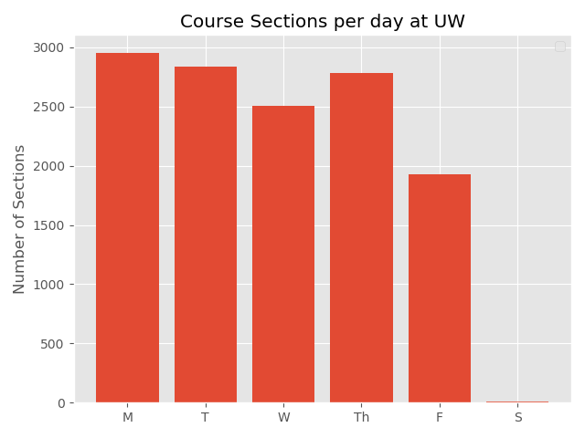

# Bar Graphs

Some Practice with MatPlotLib Bar Graphs using data parsed from the University of Washington [Time Schedule](https://www.washington.edu/students/timeschd/) in my [UW-Course-Tool](https://github.com/AlexEidt/UW-Course-Tool) project. All data is from Autumn Quarter, 2019. 

## Graphs

The first graph is a Vertical Bar Graph that shows the number of course sections offered per day at the UW.

Script: `uw_days.py`

***

The second graph is a Horizontal Bar Graph that shows which buildings are used most on each UW Campus.

Script: `uw_buildings.py`

