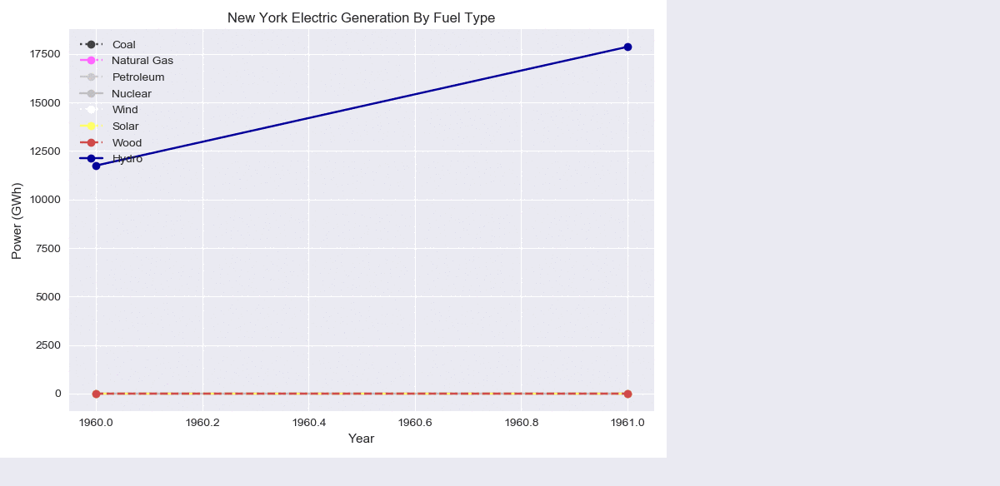
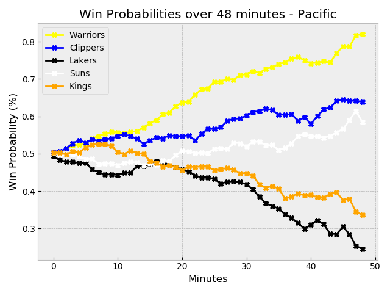

# Line Graphs

Some Practice with MatPlotLib Line Graphs using a variety of sources:

* [New York Electricity Production](https://catalog.data.gov/dataset/electric-generation-by-fuel-type-gwh-beginning-1960)
* [Bundesliga Team Data](https://github.com/camminady/AllBundesligaGamesEver)
* [Points per Game by NBA Scoring Champions](https://en.wikipedia.org/wiki/List_of_National_Basketball_Association_annual_scoring_leaders)
* [NBA Team Win Probabilities by Minute](https://github.com/fivethirtyeight/data)

## Graphs

#### New York Electricity Production

Using data from `data.gov`, this animated line graph shows the different sources of electricity production in New York from 1960 to 2016.

Script: `energy.py`

***

#### Bundesliga Team Data

The Bundesliga is a German Professional Football/Soccer league. Enter a team in the script and generate three graphs showing:
* Total Goals For/Against
* Total Home/Away Goals
* Goals For/Against Ratio

Script: `bundesliga_goals.py`

#### Points per Game by NBA Scoring Champions

Data is parsed from a Wikipedia Page showing a table of NBA Scoring Champions and emptied into a `.csv` file. Every NBA Scoring Champion since 1946 is shown in relation to the total average points per game scored by every NBA scoring champion.

Script: `nba_scoring.py`

#### NBA Team Win Probabilities by Minute

Data from a `.csv` file containing NBA Team Win Probabilites by Minute is graphed to visualize how likely NBA Teams are to win as the game goes on. Teams are split by Division, so there are five graphs in total. The Pacific Division Graph is shown.

Script: `nba_win.py`

