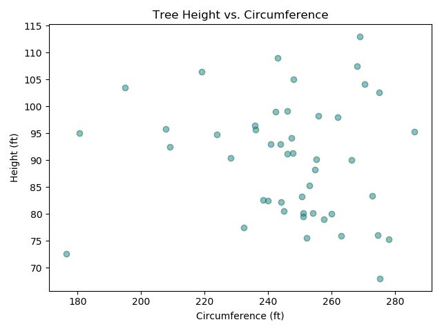
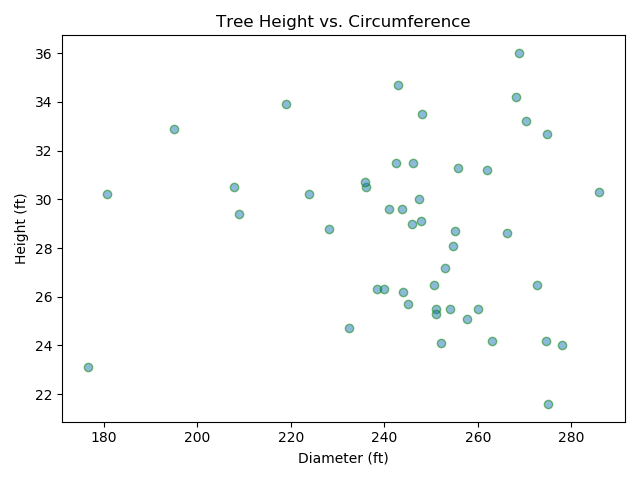
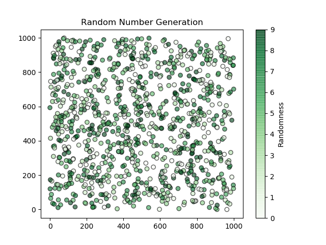

# Pie Charts

Some Practice with MatPlotLib Scatter Plots. 

## Graph

### Tree Data

Using data from this [Wikipedia Article](https://en.wikipedia.org/wiki/List_of_largest_giant_sequoias) on the largest trees on earth, a `.csv` file containing information from this table was created using the Script and put into the `Data` directory. This data was graphed on Scatter Plots to show the relationship between the largest trees heights and their circumferences, diameters, and volumes.

Script: `tallest_trees.py`

### Random

This Scatter Plot is filled with random data from Python's using the `random` module in Python.

As you can see, the data really is random!

As an example, here is the Pie Chart for my [UW-Course-Tool](https://github.com/AlexEidt/UW-Course-Tool) repository.

Script: `random_plot.py`

