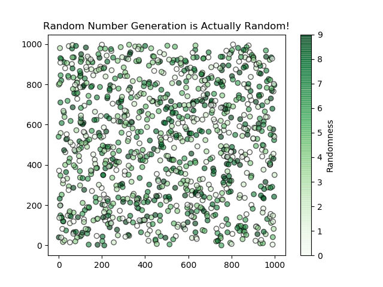

# Pie Charts

Some Practice with MatPlotLib Scatter Plots. 

## Graph

This Scatter Plot is filled with random data from Python's using the `random` module in Python.

As you can see, the data really is random!

As an example, here is the Pie Chart for my [UW-Course-Tool](https://github.com/AlexEidt/UW-Course-Tool) repository.

Script: `random_plot.py`

